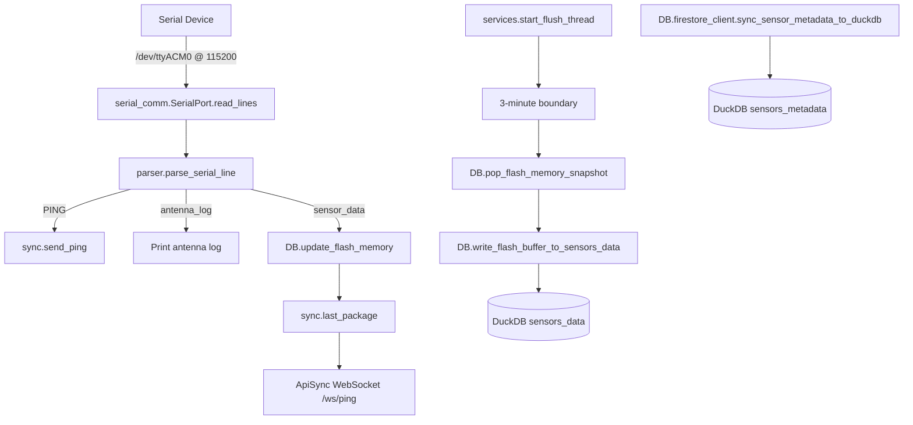
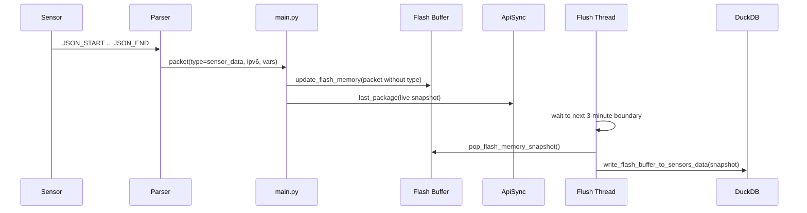

# F4D Serial Ingest Service

This project reads messages from a serial-connected device, parses structured payloads, forwards live events to ApiSync over WebSocket, and writes aggregated sensor values to DuckDB on a timed flush cycle.

## What This App Does

- Opens serial port `/dev/ttyACM0` at `115200` baud.
- Continuously reads incoming lines.
- Parses three message types:
  - `PING` lines: extracts the LLA and sends a WebSocket `Ping` event.
  - antenna initialization logs: emits `antenna_log` and prints details.
  - JSON sensor payload blocks (`JSON_START`/`JSON_END`):
    - updates an in-memory flash buffer,
    - sends live `Last_Package` payload to ApiSync,
    - and gets persisted to DuckDB on the next 3-minute flush.
- Supports metadata sync from Firestore endpoint into DuckDB `sensors_metadata`.

Entry point: `main.py`

## System Scheme



## Project Scheme

```text
F4D/
├── DB/
│   ├── __init__.py
│   ├── duckdb_client.py
│   ├── firestore_client.py
│   ├── flash_memory.py
│   └── local.duckdb
├── helpers/
│   ├── __init__.py
│   └── scheduler.py
├── initializer/
│   ├── __init__.py
│   └── env_initializer.py
├── parser/
│   ├── __init__.py
│   └── json_parser.py
├── serial_comm/
│   ├── __init__.py
│   └── port.py
├── services/
│   ├── __init__.py
│   └── flush_service.py
├── sync/
│   ├── __init__.py
│   └── ApiSync_client.py
├── .env
├── main.py
├── README.md
└── requirements.txt
```

## Sensor Package Roadmap

This is the exact flow when a sensor package is received:

1. Serial receive:
`SerialPort.read_lines()` yields raw line(s) from `/dev/ttyACM0`.

2. Parse stage:
`parse_serial_line(raw)` classifies the message as `PING`, `antenna_log`, or `sensor_data`.

3. For `sensor_data` in `main.py`:
- Remove parser-only field `type`.
- Validate `ipv6` presence.
- Call `update_flash_memory(packet_for_buffer)`.

4. Flash buffer update (`DB/flash_memory.py`):
- Key = sensor `ipv6`.
- Store latest packet payload.
- Increment `packet_count` for the current interval.
- Update `last_packet_time`.

5. Immediate live sync:
`last_package(packet_for_buffer)` sends current sensor snapshot to ApiSync via WebSocket.

6. Timed flush thread:
`start_flush_thread()` runs a daemon worker that waits for the next 3-minute boundary.

7. Atomic flush at boundary:
- `pop_flash_memory_snapshot()` takes and clears current buffer atomically.
- `write_flash_buffer_to_sensors_data(snapshot)` writes long-format rows into DuckDB `sensors_data`.
- If write fails, `restore_flash_memory_snapshot(snapshot)` restores data to avoid loss.

8. Repeat:
New packets continue accumulating in a fresh interval buffer until the next boundary.

### Sequence View



## Project Structure

- `main.py`
  - Starts timed flush worker thread.
  - Reads serial data continuously.
  - Routes parsed messages by type.
  - Sends PING and Last_Package messages to ApiSync.
  - Buffers sensor packets in flash memory.

- `parser/json_parser.py`
  - Detects and parses:
    - `PING received from: ...`
    - antenna log sequence
    - JSON payload blocks

- `DB/flash_memory.py`
  - Thread-safe in-memory buffer keyed by `ipv6`.
  - Supports update, snapshot pop, and restore for fault-tolerant flush.

- `services/flush_service.py`
  - Flush worker aligned to 3-minute clock boundaries.
  - Moves buffered data into DuckDB `sensors_data`.

- `helpers/scheduler.py`
  - Time-boundary and sleep utilities used by flush worker.

- `DB/duckdb_client.py`
  - Manages DuckDB connection and table initialization.
  - Writes interval data into `sensors_data`.
  - Applies Firestore metadata into `sensors_metadata`.

- `DB/firestore_client.py`
  - Pulls metadata from API endpoint.
  - Syncs metadata payload into DuckDB.

- `sync/ApiSync_client.py`
  - WebSocket client for:
    - `send_ping(lla)`
    - `last_package(packet)`

- `initializer/env_initializer.py`
  - Creates/updates `.env` with `HOSTNAME`, `MAC_ADDRESS`, and `API_SYNC_URL`.

## Data Tables (DuckDB)

- `sensors_metadata`:
  - Experiment and sensor metadata synced from Firestore endpoint.

- `sensors_data`:
  - Time-series rows written every 3 minutes from flash buffer snapshots.
  - One row per `(sensor, variable, flush interval)` with `Package_Count_3min`.

## Requirements

From `requirements.txt`:

- `pyserial`
- `websockets`
- `duckdb`
- `google-cloud-firestore`
- `google-cloud-bigquery`

## Setup

1. Create and activate a virtual environment.
2. Install dependencies.

```bash
python3 -m venv venv
source venv/bin/activate
pip install -r requirements.txt
```

3. Initialize environment values:

```bash
python3 -m initializer.env_initializer
```

4. Optional metadata sync:

```bash
python3 -m DB.firestore_client
```

## Running

```bash
python3 main.py
```

## Serial Input Format

### 1) PING line

```text
PING received from: <LLA>
```

### 2) Sensor JSON block

```text
JSON_START
{"ipv6":"fe80::1234", "temp":24.5, "humidity":61}
JSON_END
```

### 3) Antenna log sequence

Recognized lines include:

- `PANID 0x...`
- `Random Quote: "..."`
- `Initialization Completed Successfully.`

## .env Variables

| Key | Description |
|---|---|
| `HOSTNAME` | Sanitized system hostname used as API owner |
| `MAC_ADDRESS` | MAC address of `eth0` without colons |
| `API_SYNC_URL` | ApiSync base URL (`http://` or `https://`) |

## Troubleshooting

- Serial permission issues:
  - Add user to dialout group and reconnect session.

- No packets parsed:
  - Verify sender uses exact `JSON_START` and `JSON_END` markers.

- WebSocket sync errors:
  - Confirm `API_SYNC_URL` and `/ws/ping` reachability.

- Flush writes skipped:
  - Ensure sensor `ipv6` has active metadata in `sensors_metadata` (active experiment rows).
