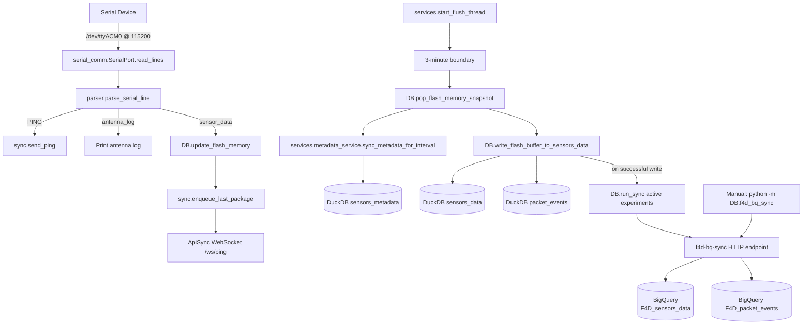
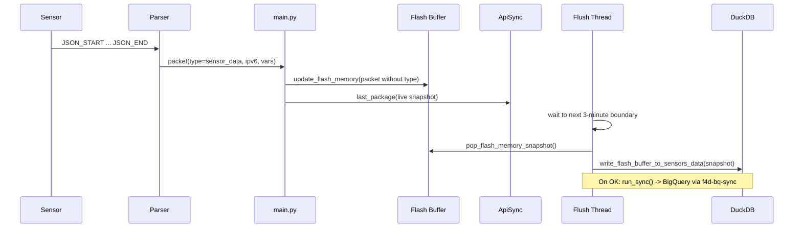

# F4D Serial Ingest Service

This project reads messages from a serial-connected device, parses structured payloads, forwards live events to ApiSync over WebSocket, writes aggregated sensor values to DuckDB on a timed flush cycle, and uploads new rows to BigQuery (automatically after each successful flush, or on demand via CLI / `run_sync`).

## What This App Does

- Opens serial port `/dev/ttyACM0` at `115200` baud (with optional auto-recovery if the port is held by `screen`; see `helpers/serial_helpers.py`).
- Continuously reads incoming lines.
- Parses three message types:
  - `PING` lines: extracts the LLA and sends a WebSocket `Ping` event.
  - antenna initialization logs: emits `antenna_log` and prints details.
  - JSON sensor payload blocks (`JSON_START`/`JSON_END`):
    - updates an in-memory flash buffer,
    - sends live `Last_Package` payload to ApiSync (queued sender thread),
    - and gets persisted to DuckDB on the next 3-minute flush.
- Syncs metadata from the Firestore-backed API into DuckDB `sensors_metadata`, including multiple active experiments when the payload contains more than one `Exp_Name`.
- Uploads DuckDB `sensors_data` and `packet_events` to BigQuery through the `f4d-bq-sync` HTTP service:
  - **Automatic:** after a successful timed flush, `services/flush_service.py` calls `DB.run_sync()` for all experiments marked active in `sensors_metadata`.
  - **Manual:** `python3 -m DB.f4d_bq_sync` or `run_sync(...)` in Python (single experiment or all active experiments).

Entry point: `main.py`

## System Scheme



## Project Scheme

```text
F4D/
├── DB/
│   ├── __init__.py
│   ├── duckdb_client.py
│   ├── f4d_bq_sync.py
│   ├── firestore_client.py
│   ├── flash_memory.py
│   └── local.duckdb
├── helpers/
│   ├── __init__.py
│   ├── scheduler.py
│   └── serial_helpers.py
├── initializer/
│   ├── __init__.py
│   └── env_initializer.py
├── parser/
│   ├── __init__.py
│   └── json_parser.py
├── serial_comm/
│   ├── __init__.py
│   └── port.py
├── services/
│   ├── __init__.py
│   ├── flush_service.py
│   └── metadata_service.py
├── sync/
│   ├── __init__.py
│   └── ApiSync_client.py
├── .env
├── main.py
├── README.md
└── requirements.txt

# Cloud (BigQuery) — written via f4d-bq-sync service, not local files:
#   F4D_sensors_data, F4D_packet_events
```

## Sensor Package Roadmap

This is the exact flow when a sensor package is received:

1. Serial receive:
`SerialPort.read_lines()` yields raw line(s) from `/dev/ttyACM0`.

2. Parse stage:
`parse_serial_line(raw)` classifies the message as `PING`, `antenna_log`, or `sensor_data`.

3. For `sensor_data` in `main.py`:
- Remove parser-only field `type`.
- Validate `ipv6` presence.
- Call `update_flash_memory(packet_for_buffer)`.

4. Flash buffer update (`DB/flash_memory.py`):
- Key = sensor `ipv6`.
- Store latest packet payload.
- Increment `packet_count` for the current interval.
- Update `last_packet_time`.
- Store packet event arrival timestamps in UTC ISO format with millisecond precision and trailing `Z`.

5. Immediate live sync:
`last_package(packet_for_buffer)` sends current sensor snapshot to ApiSync via WebSocket.

6. Timed flush thread:
`start_flush_thread()` runs a daemon worker that waits for the next 3-minute boundary.

7. Metadata refresh before write:
- `sync_metadata_for_interval()` refreshes local metadata so the interval write uses the latest active experiment rows.

8. Atomic flush at boundary:
- `pop_flash_memory_snapshot()` takes and clears current buffer atomically.
- `write_flash_buffer_to_sensors_data(snapshot)` writes long-format rows into DuckDB `sensors_data`.
- The flush interval timestamp is normalized to local naive time and trimmed to second precision.
- If write fails, `restore_flash_memory_snapshot(snapshot)` restores data to avoid loss.

9. BigQuery upload (after a successful write):
- `run_sync(table="both", exp_name=None, ...)` asks the cloud service for the last uploaded timestamp per experiment and table, then uploads only newer rows for each **active** experiment in `sensors_metadata`.
- Failures are logged and do not roll back the DuckDB write.

10. Repeat:
New packets continue accumulating in a fresh interval buffer until the next boundary.

### Sequence View



## Project Structure

- `main.py`
  - Starts timed flush worker thread and the Last_Package sender thread.
  - Opens the serial port via `open_serial_with_auto_recovery` (Linux: can detach `screen` holding `/dev/ttyACM0`).
  - Reads serial data continuously.
  - Routes parsed messages by type.
  - Sends PING and queues Last_Package messages to ApiSync.
  - Buffers sensor packets in flash memory.

- `parser/json_parser.py`
  - Detects and parses:
    - `PING received from: ...`
    - antenna log sequence
    - JSON payload blocks

- `DB/flash_memory.py`
  - Thread-safe in-memory buffer keyed by `ipv6`.
  - Supports update, snapshot pop, and restore for fault-tolerant flush.
  - Stores packet arrival timestamps in UTC ISO `...Z` format before DB normalization.

- `services/flush_service.py`
  - Flush worker aligned to 3-minute clock boundaries.
  - Refreshes metadata before each interval write.
  - Moves buffered data into DuckDB `sensors_data` and `packet_events`.
  - On successful write, runs `run_sync()` for all active experiments (both tables) unless an exception is raised (errors are logged only).

- `helpers/scheduler.py`
  - Time-boundary and sleep utilities used by flush worker.
  - Computes next boundaries in local naive device time.

- `helpers/serial_helpers.py`
  - `open_serial_with_auto_recovery`: opens `pyserial` with a best-effort cleanup when the device is busy (`lsof` + kill `screen` on Linux).

- `DB/duckdb_client.py`
  - Manages DuckDB connection and table initialization.
  - Writes interval data into `sensors_data`.
  - Writes packet-level ordering rows into `packet_events`.
  - Normalizes incoming timestamps into local naive DuckDB `TIMESTAMP` values.
  - Applies Firestore metadata into `sensors_metadata` (payloads may update several experiments in one response; inactive rows deactivate by experiment name).

- `DB/firestore_client.py`
  - Pulls metadata from API endpoint.
  - Syncs metadata payload into DuckDB.

- `sync/ApiSync_client.py`
  - WebSocket client for:
    - `send_ping(lla)`
    - queued `Last_Package` uploads (started from `main.py` via `start_last_package_sender`)

- `initializer/env_initializer.py`
  - Creates/updates `.env` with `HOSTNAME`, `MAC_ADDRESS`, `API_SYNC_URL`, and `F4D_BQ_SYNC_URL`.

- `DB/f4d_bq_sync.py`
  - **`run_sync()`** is the supported entry point (also re-exported from `DB`).
  - Reads local DuckDB rows incrementally by experiment name, owner (`HOSTNAME`), and MAC address.
  - Queries the cloud service for last-uploaded timestamps and uploads only new rows.
  - **`exp_name=None`:** discovers distinct active experiment names from `sensors_metadata` and syncs each (aggregated result status may be `ok`, `no_active_experiments`, or `partial_error` if one experiment fails).
  - **`exp_name` set:** syncs that single experiment only.
  - CLI: `--table sensors_data|packet_events|both`; `--exp` optional (omit for active mode).
  - Optional `--limit`, `--batch-size`, `--owner`, `--mac`, `--sync-url`, `--dry-run`.

## Data Tables (DuckDB)

- `sensors_metadata`:
  - Experiment and sensor metadata synced from the Firestore-backed API.
  - Multiple rows may be active at once (distinct `Exp_Name` values with `Active_Exp = true`); BQ sync iterates those names when `exp_name` is not specified.

- `sensors_data`:
  - Time-series rows written every 3 minutes from flash buffer snapshots.
  - One row per `(sensor, variable, flush interval)` with `Package_Count_3min`.

- `packet_events`:
  - Packet-level interval event rows derived from flash-buffer arrival logs.
  - Includes per-sensor interval order and global order within the flush interval.

## Time Handling

- Flash-memory packet arrivals are captured in UTC ISO format with millisecond precision, for example `2026-03-20T12:34:56.789Z`.
- DuckDB storage normalizes timezone-aware timestamps into local machine time and stores them as naive `TIMESTAMP` values.
- Flush interval timestamps are trimmed to second precision before being written to `sensors_data` and `packet_events`.
- Packet event ordering is sorted by normalized packet arrival time, then by sensor `LLA`.

## DuckDB Debug & Inspection Queries

Example command to open the database safely while the service is running:

```bash
duckdb -readonly /home/pi/F4D/DB/local.duckdb
```

This prevents locking the database used by the `f4d-main.service`.

### 1. Show all active experiments

```sql
SELECT
  LLA,
  Owner,
  Mac_Address,
  Exp_Name,
  Exp_ID,
  Location,
  Active_Exp,
  Exp_Started_At
FROM sensors_metadata
WHERE Active_Exp = true
ORDER BY Exp_ID, LLA;
```

Purpose:
Shows all sensors currently participating in active experiments.

### 2. Experiment summary (one row per experiment)

```sql
SELECT
  Exp_Name,
  Exp_ID,
  COUNT(*) AS sensors_in_experiment,
  MIN(Exp_Started_At) AS started_at
FROM sensors_metadata
WHERE Active_Exp = true
GROUP BY Exp_Name, Exp_ID
ORDER BY Exp_ID;
```

Purpose:
Quick overview of running experiments and how many sensors are attached.

### 3. Inspect a specific experiment

```sql
SELECT
  LLA,
  Exp_Name,
  Exp_ID,
  Active_Exp,
  Exp_Started_At,
  Exp_Ended_At,
  Snapshot_At
FROM sensors_metadata
WHERE Exp_ID = <EXP_ID>
ORDER BY LLA;
```

Example:

```sql
WHERE Exp_ID = 8;
```

Purpose:
Shows full sensor state for a specific experiment.

### 4. **ALERT** Stop an experiment manually (testing only)

```sql
UPDATE sensors_metadata
SET
  Active_Exp = false,
  Exp_Ended_At = CURRENT_TIMESTAMP,
  Updated_At = CURRENT_TIMESTAMP
WHERE Exp_Name = '<EXP_NAME>'
  AND Active_Exp = true;
```

Purpose:
Used during development to stop an experiment locally. **ALERT:** this changes local database state.

### 5. Show full experiment history

```sql
SELECT
  Exp_Name,
  Exp_ID,
  Active_Exp,
  LLA,
  Exp_Started_At,
  Exp_Ended_At
FROM sensors_metadata
ORDER BY Exp_ID, LLA;
```

Purpose:
Shows both BOOT rows and experiment rows to understand the lifecycle.

### 6. Show inactive or replaced sensors

```sql
SELECT
  LLA,
  Owner,
  Mac_Address,
  Exp_Name,
  Exp_ID,
  Location,
  Active_Exp,
  Is_Active,
  Exp_Ended_At,
  Snapshot_At
FROM sensors_metadata
WHERE Active_Exp = false
ORDER BY Exp_ID, LLA;
```

Purpose:
Shows sensors that were removed, replaced, or ended so you can verify the full lifecycle.

### 7. Find the most recently modified metadata rows

```sql
SELECT
  LLA,
  Exp_Name,
  Exp_ID,
  Active_Exp,
  Location,
  Is_Active,
  Updated_At,
  Snapshot_At
FROM sensors_metadata
ORDER BY Updated_At DESC NULLS LAST, Snapshot_At DESC
LIMIT 20;
```

Purpose:
Helps inspect the latest metadata changes after a sync or replacement event.

### 8. Count sensors by experiment state

```sql
SELECT
  Exp_Name,
  Exp_ID,
  Active_Exp,
  COUNT(*) AS sensor_count
FROM sensors_metadata
GROUP BY Exp_Name, Exp_ID, Active_Exp
ORDER BY Exp_ID, Active_Exp DESC, Exp_Name;
```

Purpose:
Quick overview of how many sensor rows are active or inactive in each experiment.

### 9. Show BOOT rows only

```sql
SELECT
  LLA,
  Owner,
  Mac_Address,
  Exp_Name,
  Exp_ID,
  Active_Exp,
  Snapshot_At
FROM sensors_metadata
WHERE Exp_ID = 0
ORDER BY LLA;
```

Purpose:
Useful for checking the boot inventory and confirming that each sensor has a local base record.

## Requirements

From `requirements.txt`:

- `pyserial`
- `websockets`
- `duckdb`
- `google-cloud-firestore`
- `google-cloud-bigquery`

## Setup

1. Create and activate a virtual environment.
2. Install dependencies.

```bash
python3 -m venv venv
source venv/bin/activate
pip install -r requirements.txt
```

3. Initialize environment values:

```bash
python3 -m initializer.env_initializer
```

4. Install the DuckDB CLI (optional; useful for inspecting `local.duckdb` from the shell). Preferred method:

```bash
curl https://install.duckdb.org | sh
```

   Add the CLI to your `PATH` (default install location for user `pi`; change `/home/pi` if needed):

```bash
echo 'export PATH=$PATH:/home/pi/.duckdb/cli/latest' >> ~/.bashrc
source ~/.bashrc
```

   Smoke test:

```bash
duckdb -readonly
```

5. Optional metadata sync:

```bash
python3 -m DB.firestore_client
```

## Running

```bash
python3 main.py
```

## Test and Validation Cheat Sheet

Use this section as a quick runbook to validate parser behavior, metadata sync, timed flush writes, and WebSocket flow.

### 0) Fast preflight

```bash
cd /home/pi/F4D
python3 --version
python3 -m pip install -r requirements.txt
python3 -m initializer.env_initializer
```

Check required environment keys:

```bash
grep -E '^(HOSTNAME|MAC_ADDRESS|API_SYNC_URL|F4D_BQ_SYNC_URL)=' /home/pi/F4D/.env
```

### 1) Parser smoke tests (no serial device required)

```bash
python3 - <<'PY'
from parser import parse_serial_line

print(parse_serial_line('PING received from: fe80::abcd\n'))
print(parse_serial_line('JSON_START\n'))
print(parse_serial_line('{"ipv6":"fe80::1234","temp":24.5,"humidity":61}\n'))
print(parse_serial_line('JSON_END\n'))
print(parse_serial_line('PANID 0x1A2B\n'))
print(parse_serial_line('Random Quote: "hello"\n'))
print(parse_serial_line('Initialization Completed Successfully.\n'))
PY
```

Expected:
- First line returns a dict with `type = PING`.
- JSON block returns a dict with `type = sensor_data`.
- Antenna sequence returns a dict with `type = antenna_log` when completed.

### 2) Metadata sync validation

Run metadata sync directly:

```bash
python3 - <<'PY'
from DB.firestore_client import sync_sensor_metadata_to_duckdb
result = sync_sensor_metadata_to_duckdb()
print(result)
PY
```

Inspect DuckDB metadata rows:

```bash
python3 - <<'PY'
import duckdb
con = duckdb.connect('/home/pi/F4D/DB/local.duckdb')
print('metadata rows:', con.execute('select count(*) from sensors_metadata').fetchone()[0])
print(con.execute('''
    select LLA, Exp_ID, Exp_Name, Active_Exp
    from sensors_metadata
    order by Snapshot_At desc
    limit 10
''').fetchall())
PY
```

### 3) Live ingest + timed flush validation

Start the service and watch logs:

```bash
cd /home/pi/F4D
python3 main.py
```

What to look for in logs:
- `[SYNC] Waiting for 3-minute sync clock...`
- `[FLASH] Updated buffer for sensor: ...`
- `[Web-Socket] Queued sensor data for upload: ...`
- At boundary: `[SYNC] 3-minute boundary reached...`
- Metadata refresh: `[METADATA] Starting metadata refresh before interval write...`
- Write summary: `[WRITE:sensors_data] ...` and `[WRITE:packet_events] ...`
- After a successful write: `[BQ SYNC] - Starting Automatic BigQuery sync for active experiments...` then `[BQ SYNC RESULT] ...` or `[BQ SYNC ERROR] ...`

### 4) Post-flush database checks

After at least one 3-minute boundary passes:

```bash
python3 - <<'PY'
import duckdb
con = duckdb.connect('/home/pi/F4D/DB/local.duckdb')

print('sensors_data rows:', con.execute('select count(*) from sensors_data').fetchone()[0])
print('packet_events rows:', con.execute('select count(*) from packet_events').fetchone()[0])

print('\nLatest sensors_data rows:')
for row in con.execute('''
    select Timestamp, LLA, Variable, Value, Package_Count_3min
    from sensors_data
    order by Timestamp desc
    limit 10
''').fetchall():
    print(row)

print('\nLatest packet_events rows:')
for row in con.execute('''
    select Interval_Timestamp, LLA, Packet_Order_In_LLA_Interval, Packet_Order_Global_Interval, Packet_Count_3min
    from packet_events
    order by Interval_Timestamp desc, Packet_Order_Global_Interval desc
    limit 10
''').fetchall():
    print(row)
PY
```

### 5) WebSocket/API quick checks

Validate ApiSync URL format in `.env` (must start with `http://` or `https://`):

```bash
grep '^API_SYNC_URL=' /home/pi/F4D/.env
```

If Last_Package sends are failing, monitor for:
- `[Web-Socket] Failed to send LastPackage: ...`
- `[Web-Socket] Queue full, dropping packet ...`

### 6) DuckDB to BigQuery sync (CLI and code)

**Active experiments (recommended default):** omit `--exp` so every distinct `Exp_Name` with `Active_Exp = true` in `sensors_metadata` is synced.

Dry-run both tables for all active experiments:

```bash
python3 -m DB.f4d_bq_sync --table both --dry-run
```

Upload both tables for all active experiments:

```bash
python3 -m DB.f4d_bq_sync --table both --batch-size 500
```

**Single experiment:** pass `--exp` to scope uploads to one experiment name (must match `Exp_Name` in DuckDB / cloud filter).

```bash
python3 -m DB.f4d_bq_sync --table sensors_data --exp "<EXP_NAME>" --dry-run
```

Optional overrides for testing:

```bash
python3 -m DB.f4d_bq_sync \
  --table packet_events \
  --exp "<EXP_NAME>" \
  --limit 100 \
  --owner "<HOSTNAME>" \
  --mac "<MAC_ADDRESS>" \
  --sync-url "https://your-bq-sync-service"
```

**From Python** (same behavior as the service after flush):

```python
from DB import run_sync

result = run_sync(table="both", exp_name=None, dry_run=False)
```

What the sync does:
- Reads `HOSTNAME`, `MAC_ADDRESS`, and `F4D_BQ_SYNC_URL` from `.env` by default (unless overridden).
- Asks the cloud service for the last uploaded timestamp per table (and experiment when applicable).
- Selects only newer local rows from DuckDB.
- Uploads to `F4D_sensors_data` and/or `F4D_packet_events`.
- CLI exit code `0` when status is `ok` or `no_active_experiments`; `1` when status is `partial_error` or on fatal errors.

### 7) Common validation outcomes

- Parser OK, no DB writes:
  - usually means no active metadata row for that sensor LLA.
- Metadata OK, no live upload:
  - check API reachability and `API_SYNC_URL` value.
- Flash buffer restored after boundary:
  - indicates timed write failure; check DB file permissions and logs.

## Serial Input Format

### 1) PING line

```text
PING received from: <LLA>
```

### 2) Sensor JSON block

```text
JSON_START
{"ipv6":"fe80::1234", "temp":24.5, "humidity":61}
JSON_END
```

### 3) Antenna log sequence

Recognized lines include:

- `PANID 0x...`
- `Random Quote: "..."`
- `Initialization Completed Successfully.`

## .env Variables

| Key | Description |
|---|---|
| `HOSTNAME` | Sanitized system hostname used as API owner |
| `MAC_ADDRESS` | MAC address of `eth0` without colons |
| `API_SYNC_URL` | ApiSync base URL (`http://` or `https://`) |
| `F4D_BQ_SYNC_URL` | HTTP endpoint used by `DB/f4d_bq_sync.py` for BigQuery sync |

## Troubleshooting

- Serial permission issues:
  - Add user to dialout group and reconnect session.

- No packets parsed:
  - Verify sender uses exact `JSON_START` and `JSON_END` markers.

- WebSocket sync errors:
  - Confirm `API_SYNC_URL` and `/ws/ping` reachability.

- Flush writes skipped:
  - Ensure sensor `ipv6` has active metadata in `sensors_metadata` (active experiment rows).

- BigQuery sync skipped or errors:
  - Automatic sync only runs after a **successful** `sensors_data` / `packet_events` write; fix any write/DB permission issues first.
  - Confirm `F4D_BQ_SYNC_URL` and network reachability; check `[BQ SYNC ERROR]` logs.
  - With `--exp` omitted, ensure at least one row in `sensors_metadata` has `Active_Exp = true` and a non-empty `Exp_Name`.

## Related repo: device registry in BigQuery

The sibling folder [`users-devices-permission`](../users-devices-permission/README.md) documents a Google Cloud Function that upserts MAC addresses, owners, and related metadata in BigQuery. Field devices identify uploads to the BQ sync service using `HOSTNAME` and `MAC_ADDRESS` from `.env` (written by `initializer/env_initializer.py`), which should stay consistent with how devices are registered upstream.

## Exit from the screen 
- screen -ls
- screen -r XXXXX
- Ctrl + A, then K -> to confirm press "y"

## journal Tricks and commands
- normal journal
  - journalctl -u f4d-main.service -f
- journal with high precision
  - journalctl -u f4d-main.service -o short-precise -f