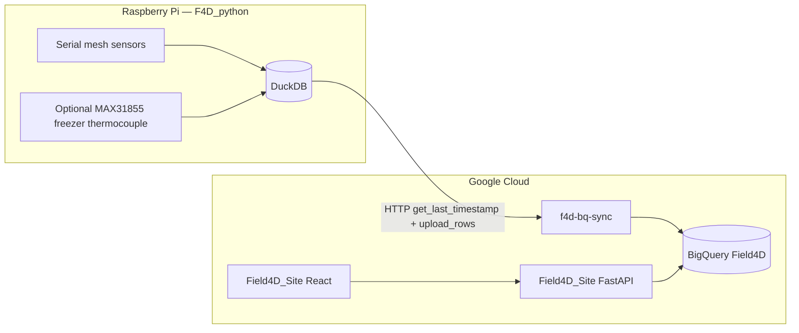

# Field4D Google Cloud Monorepo

This repository contains Field4D cloud services, data pipelines, frontend/backend applications, Raspberry Pi ingestion code, and legacy Cloud Functions.

**Last updated:** May 27, 2026

## End-to-end data flow



Typical path: field devices ingest serial (and optionally local thermocouple) data into DuckDB, upload incrementally to BigQuery via `f4d-bq-sync`, and users explore the same long-format tables through the web app.

## Repository Structure

Current top-level folders:

| Folder | Role | Local docs |
|--------|------|------------|
| `Field4D_Site/` | Main web app — React frontend + FastAPI backend over BigQuery | [README](Field4D_Site/README.md) |
| `F4D_python/` | Pi ingestion runtime — serial parse, DuckDB flush, ApiSync WebSocket, BQ upload client | [README](F4D_python/README.md) |
| `f4d-bq-sync/` | Cloud Run / Functions HTTP service — incremental BigQuery append for device uploads | [README](f4d-bq-sync/README.md) |
| `Reggie_Online/` | ApiSync service and related tooling | — |
| `f4d-auth-service/` | Auth service for issuing/verifying access | — |
| `field4d_analytics/` | Analytics and statistics APIs/jobs | — |
| `f4d-email-sender/` | HTML email sender (used by Pi-side freezer alerts, among others) | — |
| `f4d-user-access-manager/` | User/permission management backend | — |
| `fetch_google/` | BigQuery/data pull scripts and notebooks | — |
| `legacy gcp cloud function/` | Archived legacy Cloud Functions (migrated under one folder) | — |
| `F4D/` | Original Field4D processing utilities | — |
| `F4D_Pi_V2/` | Raspberry Pi v2 runtime/project | — |
| `f4d-register-device/` | Device registration components | — |
| `cloud_upload_alerts/` | Alert/upload cloud workflows | — |
| `SPAC automatic Pull/` | SPAC automation utilities | — |

Legacy Cloud Function subfolders under `legacy gcp cloud function/` include `login_and_issue_jwt/`, `process_files/`, `query_last_timestamp/`, `update-labels/`, `upload_To_bucket/`, and `users-devices-permission/`.

## Recent updates (May 2026)

Cross-module work on **virtual freezer thermocouple monitoring** and richer metadata:

### `F4D_python/` — device ingest

- Optional **MAX31855 thermocouple** reader (`sensors/freezer_reader.py`) configured via `config/freezer_sensor.json`.
- Background **virtual sensor service** injects freezer packets into the normal flash-buffer and ApiSync flow (`services/virtual_sensor_service.py`).
- Configurable **Pi-side email alerts** when freezer temperature exceeds a threshold (via `f4d-email-sender`).
- See [F4D_python/README.md](F4D_python/README.md) for wiring, SPI pinout, and enable steps.

### `f4d-bq-sync/` — cloud upload API

- BigQuery schemas now store **timezone** (`Time_Zone`) plus experiment/sensor metadata (labels, coordinates, locations) aligned with DuckDB.
- More robust dataset/table creation and insert retry on missing tables.
- Optional **cost-effective** `get_last_timestamp` variant (`main - cost efective.py`) — 14-day scan with full-table fallback.
- See [f4d-bq-sync/README.md](f4d-bq-sync/README.md) for API payloads and schema tables.

### `Field4D_Site/` — web UI

- Recognizes freezer thermocouple LLAs (`_freezer_thermo_`) with sensor dropdown subtitles and a dedicated parameter category.
- Label filter panel handles experiments with placeholder `labelOptions` (for example `["[]"]`) without blocking sensor selection.
- Dual-axis scatter/box plots use **per-parameter** Y-axis titles.
- See [Field4D_Site/README.md](Field4D_Site/README.md) for architecture, deployment, and component map.

## Notes on Folder Renames / Reorganization

The project was reorganized and some historical roots were moved/renamed, for example:

- `f4d_bq_sync/` → `f4d-bq-sync/`
- `login_and_issue_jwt/` and other old function folders → `legacy gcp cloud function/...`

When adding new top-level directories, update `.gitignore` allowlist rules accordingly because this repo uses a default-ignore pattern (`*`) with explicit include paths.

## Security and Credentials

- Never commit secrets, service account keys, or `.env` files.
- The repository ignore rules block common secret files and Python-generated artifacts.
- `fetch_google/read_BQ.json` is explicitly ignored and must stay local-only.
- If a credential was ever committed, rotate/revoke it immediately in Google Cloud.
- GitHub Push Protection is enabled and will block pushes containing detected credentials.

## Getting Started

1. Go into the specific module you want to run.
2. Read that module's local `README.md`.
3. Install dependencies from that module's `requirements.txt` / `package.json`.
4. Configure credentials locally (environment variables or local key files outside git-tracked paths).
5. Run the module-specific start command.

Examples:

```bash
# Web frontend (dev)
cd Field4D_Site/frontend
npm install
npm run dev
```

```bash
# Pi ingest (on device)
cd F4D_python
pip install -r requirements.txt
python3 -m initializer.env_initializer
python3 main.py
```

```bash
# BigQuery sync service (local)
cd f4d-bq-sync
pip install -r requirements.txt
functions-framework --target=f4d_bq_sync --debug
```

## Contributing

- Keep changes scoped to one module when possible.
- Avoid committing generated files (`__pycache__`, `*.pyc`, virtual env folders, notebook outputs unless intentional).
- If you add or move top-level folders, update `.gitignore` allowlist entries.
- When API contracts or upload schemas change, update both the service README and downstream callers (for example `F4D_python/DB/f4d_bq_sync.py` and `Field4D_Site/backend_fastapi/`).

## License

See `LICENSE`.
