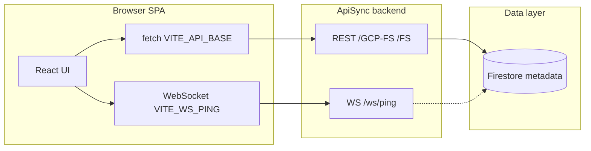
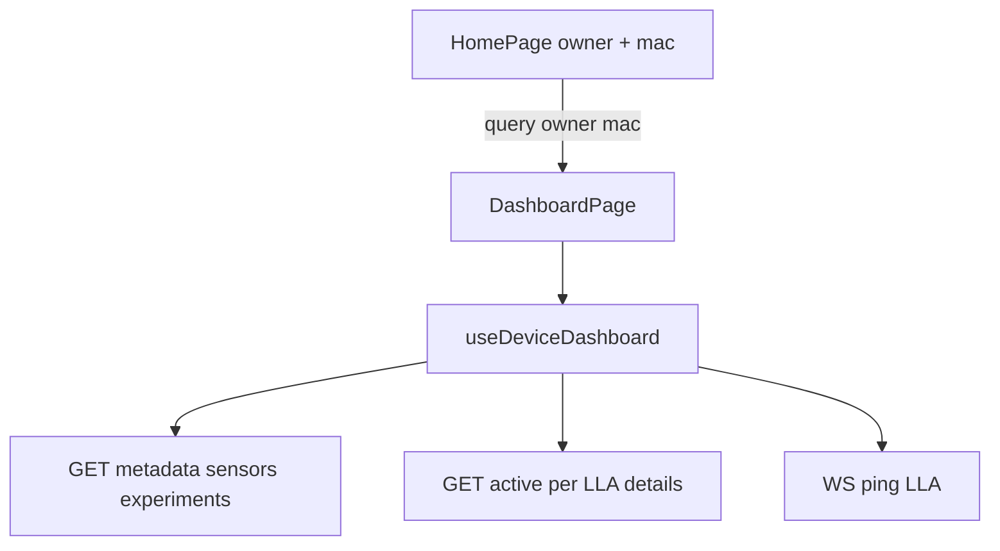
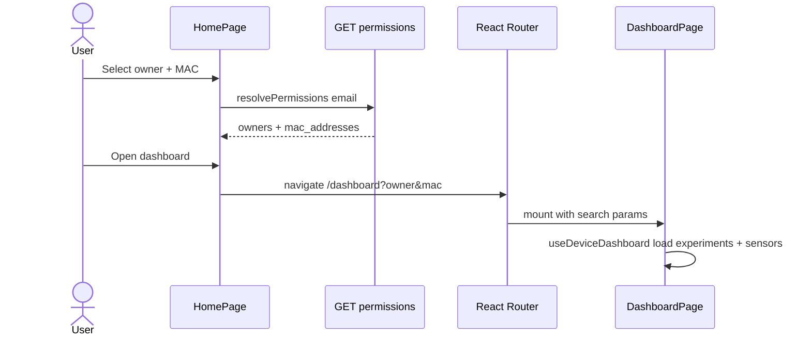
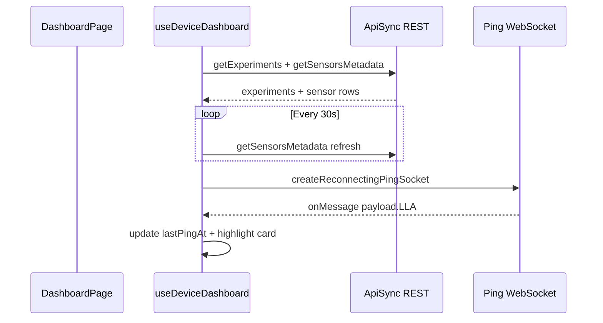

# Reggie Online — Frontend (`reggie_online`)

React + TypeScript + Vite SPA for **Field 4D** device and sensor metadata: pick a **gateway** (owner + MAC), open the **dashboard**, browse experiments, refresh Firestore-backed metadata, see **live ping** highlights, run **experiment** actions, **CSV** metadata prep/upload, and **replace sensor** flows.  
HTTP calls go to the **ApiSync** backend (`VITE_API_BASE`); real-time **pings** use a separate **WebSocket** URL (`VITE_WS_PING`).

---

## Table of contents

1. [Tech stack](#tech-stack)
2. [Prerequisites](#prerequisites)
3. [Environment variables](#environment-variables)
4. [Install and run](#install-and-run)
5. [Project structure](#project-structure)
6. [System scheme](#system-scheme)
7. [Sequence views](#sequence-views)
8. [Routing](#routing)
9. [Features (functional map)](#features-functional-map)
10. [HTTP API surface (used by this app)](#http-api-surface-used-by-this-app)
11. [WebSocket (ping)](#websocket-ping)
12. [Ping highlight styling](#ping-highlight-styling)
13. [Build](#build)

---

## Tech stack

| Layer | Choice |
|--------|--------|
| UI | React 19, TypeScript |
| Routing | `react-router-dom` v7 |
| Styling | Tailwind CSS 3, global styles in [`src/index.css`](src/index.css) |
| Build | Vite 8 |
| HTTP | `fetch` via [`src/api/apisyncClient.ts`](src/api/apisyncClient.ts) |
| Real-time | WebSocket [`src/websocket/pingSocket.ts`](src/websocket/pingSocket.ts) (reconnecting client) |

---

## Prerequisites

- **Node.js** (LTS recommended) and **npm**
- A running or deployed **ApiSync** instance whose URL matches `VITE_API_BASE` (and WebSocket endpoint for `VITE_WS_PING`)

---

## Environment variables

Defined in [`.env`](.env) (Vite prefix `VITE_` required for client exposure):

| Variable | Purpose |
|----------|---------|
| `VITE_API_BASE` | Base URL for REST calls (no trailing slash), e.g. `https://…run.app` |
| `VITE_WS_PING` | Full WebSocket URL for ping stream, e.g. `wss://…run.app/ws/ping` |

Example shape (values are deployment-specific):

```env
VITE_API_BASE=https://apisync-….us-central1.run.app
VITE_WS_PING=wss://apisync-….us-central1.run.app/ws/ping
```

---

## Install and run

```bash
cd reggie_online
npm install
npm run dev
```

- **Dev server**: Vite default (see terminal output, typically `http://localhost:5173`).
- **Production build**: `npm run build` → output in `dist/`.
- **Preview build**: `npm run preview`.

---

## Project structure

```
reggie_online/
├── .env                 # VITE_API_BASE, VITE_WS_PING (not committed if gitignored)
├── package.json
├── vite.config.ts
├── tsconfig.json
├── index.html           # Vite entry HTML
└── src/
    ├── main.tsx         # React root, BrowserRouter, imports index.css
    ├── App.tsx          # Routes: /, /dashboard
    ├── index.css        # Tailwind + ping animation (--ping-blink-color, etc.)
    ├── api/
    │   ├── apisyncClient.ts   # GET helper (VITE_API_BASE)
    │   ├── metadata.ts        # Experiments, sensors, active metadata
    │   └── permissions.ts     # Resolve owners/MACs by email
    ├── hooks/
    │   ├── useDeviceDashboard.ts  # Dashboard state, polling, ping socket, details
    │   └── useRealtimePing.ts     # Optional standalone reconnecting ping socket
    ├── websocket/
    │   └── pingSocket.ts          # createPingSocket, createReconnectingPingSocket
    ├── pages/
    │   ├── HomePage.tsx           # Device selection → dashboard query params
    │   └── DashboardPage.tsx      # Main dashboard UI (large)
    ├── components/
    │   ├── Header/
    │   ├── Dashboard/             # DashboardTopBar, SensorGrid/SensorCard (placeholders)
    │   └── Modals/                # SensorDetails, ReplaceSensor, CenteredDialog, …
    ├── utils/
    │   ├── replaceSensor.ts       # Replace payload + eligibility helpers
    │   ├── csv.ts, csvUpload.ts
    │   └── date.ts
    └── store/
        └── dashboard.store.ts     # (legacy / optional usage)
```

**Note:** Sensor cards are largely **inline** in [`DashboardPage.tsx`](src/pages/DashboardPage.tsx); `SensorGrid.tsx` / `SensorCard.tsx` are minimal placeholders.

---

## System scheme

High-level view: browser app talks to **ApiSync** over HTTPS and **WSS**; backend owns Firestore and business rules.



### Data flow (dashboard)



---

## Sequence views

### 1. Open dashboard from home



### 2. Metadata refresh and ping (parallel concerns)



### 3. Replace sensor (summary)

```mermaid
sequenceDiagram
  participant User
  participant Dash as DashboardPage
  participant Details as SensorDetailsModal
  participant Replace as ReplaceSensorModal
  participant API as POST /FS/sensor/update-metadata
  User->>Dash: Click sensor card
  Dash->>Details: open details
  User->>Details: Replace Sensor
  Details->>Replace: open batch replace UI
  User->>Replace: Confirm then Approve and send
  Replace->>API: batch 2 sensors deactivate + activate
  API-->>Dash: success
  Dash->>Dash: toast + refreshDeviceData
```

---

## Routing

| Path | Component | Notes |
|------|-----------|--------|
| `/` | [`HomePage`](src/pages/HomePage.tsx) | Permissions, owner/MAC pick, navigate to dashboard |
| `/dashboard` | [`DashboardPage`](src/pages/DashboardPage.tsx) | Requires `?owner=&mac=` query params |
| `*` | Redirect to `/` | Unknown paths |

Dashboard also syncs experiment filter with `?exp=` via [`useDeviceDashboard`](src/hooks/useDeviceDashboard.ts).

---

## Features (functional map)

| Area | Implementation |
|------|----------------|
| Device context | URL query `owner`, `mac`; persisted in `localStorage` (last / preferred device keys) |
| Experiments list | From `getExperiments` + experiment names derived from sensors |
| Sensor grid | Filter by experiment, search, sort, activity/label filters |
| Sensor details | [`SensorDetailsModal`](src/components/Modals/SensorDetailsModal.tsx) + `getActiveMetadata` |
| Live ping | WebSocket messages with `payload.LLA`; card class `sensor-card-pinging`; toast “Find” |
| Experiment start/end | Batch `POST /FS/sensor/update-metadata` from dashboard actions |
| CSV template / upload | Download template, validate CSV, confirm upload via same endpoint |
| Replace sensor | From details → [`ReplaceSensorModal`](src/components/Modals/ReplaceSensorModal.tsx) + [`replaceSensor.ts`](src/utils/replaceSensor.ts) |

---

## HTTP API surface (used by this app)

All requests use `VITE_API_BASE` as prefix (see [`apisyncClient.ts`](src/api/apisyncClient.ts)).

| Method | Path pattern | Used in |
|--------|----------------|--------|
| GET | `/GCP-FS/permissions/resolve?email=` | [`permissions.ts`](src/api/permissions.ts) |
| GET | `/GCP-FS/metadata/sensors?owner=&mac_address=` | [`metadata.ts`](src/api/metadata.ts) |
| GET | `/GCP-FS/metadata/experiments?owner=&mac_address=` | [`metadata.ts`](src/api/metadata.ts) |
| GET | `/GCP-FS/metadata/active?owner=&mac_address=&lla=` | [`metadata.ts`](src/api/metadata.ts) |
| POST | `/FS/sensor/update-metadata` | [`DashboardPage.tsx`](src/pages/DashboardPage.tsx) (experiment actions, CSV, replace, clear prepared) |

> **Auth:** This client uses plain `fetch` for GET/POST as implemented; align with backend auth (cookies, API keys) if your deployment requires it.

---

## WebSocket (ping)

- **URL:** `VITE_WS_PING` (full `wss://…` URL).
- **Client:** [`createReconnectingPingSocket`](src/websocket/pingSocket.ts) — reconnects with backoff and on browser `online` event.
- **Integration:** Primary consumer is [`useDeviceDashboard`](src/hooks/useDeviceDashboard.ts) (`onSensorPing` callback optional for dashboard chrome).

Message shape assumed (flexible): JSON with `payload.LLA` or `payload.lla`.

---

## Ping highlight styling

Configured in [`src/index.css`](src/index.css):

- **`--ping-blink-color`** — main ping tint (inset + glows), any CSS color.
- **`--ping-blink-accent`** — optional outer halo; set equal to main for a single hue.
- **`--ping-card-border`** — card border during animation (default neutral slate in repo; adjust locally).

Uses `color-mix()` so one hex drives all mixed opacities without maintaining separate RGB triplets.

---

## Build

```bash
npm run build
```

Runs `tsc && vite build`; static assets emitted to `dist/`. Serve `dist/` behind HTTPS; configure reverse proxy if WebSocket and API share the same host.

---

## Related repositories

- **ApiSync** backend and API contracts live in the parent repo ([`../backend`](../backend), repo root docs such as [`../README.md`](../README.md) / [`../ARCHITECTURE.md`](../ARCHITECTURE.md) when present).

---

*Last updated to match the `reggie_online` tree and primary flows described above.*
